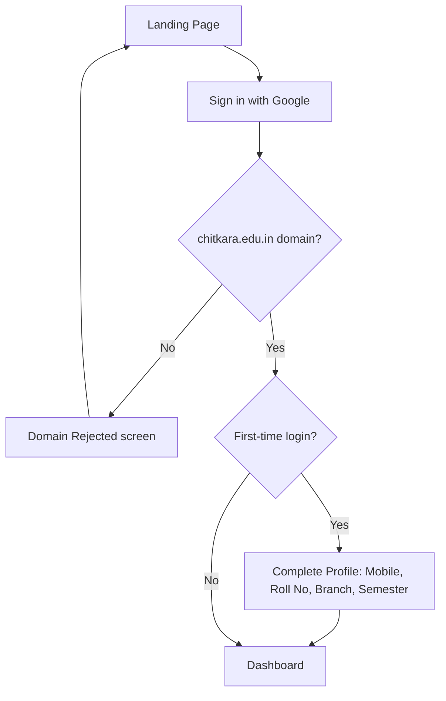
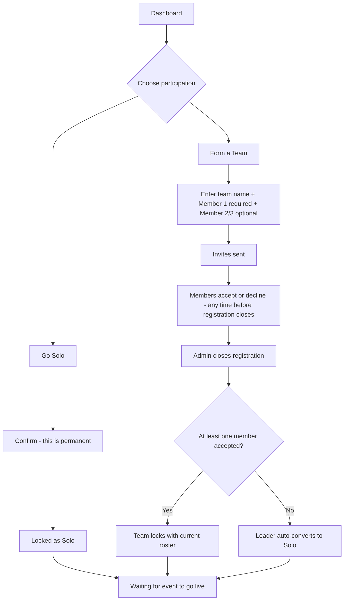
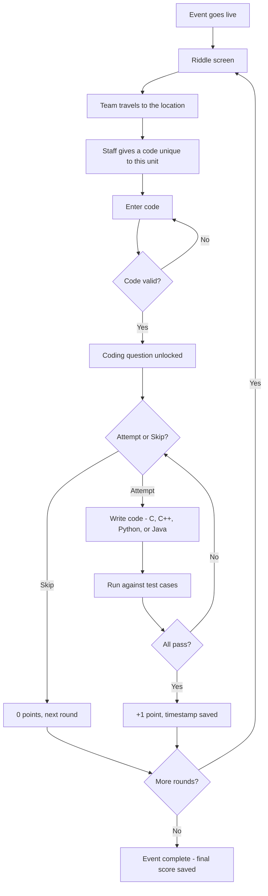
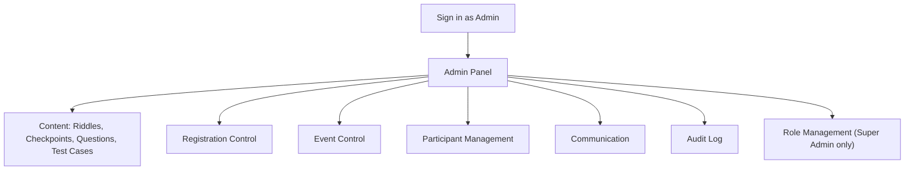

# Tech Track — App Flow Document

| | |
|---|---|
| **Companion to** | Tech Track PRD v1.0 and TRD v1.0 |
| **Version** | 1.0 |
| **Status** | Ready for Phase 1 |

This document walks through every screen and transition a person sees, for each role. It pairs with the TRD's API list — each transition below is backed by one of those endpoints.

---

## 1. Sign-In & Onboarding (all roles, first touch)

| Screen | Purpose | Key elements | Leads to |
|---|---|---|---|
| Landing | Entry point | "Sign in with Google" | Google OAuth |
| Domain Rejected | Wrong email domain used | Error message, back link | Landing |
| Complete Profile | First login only | Mobile number, Roll No., Branch, Semester | Dashboard |
| Dashboard | Home base for every participant | Lock Registration section, Tech Track Event section (locked until Admin activates), pending-invite banner | Registration locking, or Event once live |

Admins, Super Admin, and Checkpoint Staff sign in through this exact same screen — role is what determines where they land next (Section 4/5 instead of the participant dashboard).

## 2. Registration Locking — Solo & Team

| Screen | Purpose | Key elements | Leads to |
|---|---|---|---|
| Lock Registration | Choice point | "Go Solo" / "Form a Team" | Solo confirm, or Team form |
| Solo Confirm | Final warning | Confirm / cancel | Locked (Solo) |
| Locked (Solo) | Confirmation state | "You're locked in as solo" | Dashboard, waiting for event |
| Team Form | Leader builds the team | Team name, Member 1 (required), Member 2/3 (optional) — all `@chitkara.edu.in` | Invites Sent |
| Invites Sent | Leader's live status view | Roster with each member's status (pending / accepted / declined) | Team Locked, once registration closes |
| Invite Banner | Invitee's view | "[Leader] invited you to [Team]" — Accept / Decline | Team Roster, or back to Dashboard if declined |
| Team Roster | Post-accept view | Team name, Leader + Member labels | Dashboard, waiting for event |

## 3. Event Gameplay Loop (Solo & Team — identical once locked)

| Screen | Purpose | Key elements | Leads to |
|---|---|---|---|
| Riddle Screen | Current round | Riddle text, secret-code field | Code check |
| Code Rejected | Wrong code entered | Error, retry field | Riddle Screen |
| Question Screen | The coding challenge | Prompt, language picker (C/C++/Python/Java), in-browser editor, one visible sample test case, Run, Submit, Skip | Result screen |
| Result — Fail | A test case failed | Which sample check failed, Retry / Skip | Question Screen, or next round if skipped |
| Result — Pass | All hidden tests passed | "+1 point" confirmation | Next Riddle |
| Completion / Leaderboard | End state | Final score, live leaderboard | — |

Tab-switch or window-blur events on the Question Screen are logged silently in the background — there's no visible interruption to the participant, per the "log, don't block" decision in the PRD.

## 4. Admin Panel (Admin & Super Admin)

| Section | Purpose |
|---|---|
| Content | Create/edit/reorder riddles and checkpoints; create questions with hidden + sample test cases |
| Registration Control | Open/close registration; closing triggers unit finalization and code generation |
| Event Control | Start/stop the live event section for everyone |
| Participant Management | Full list of units and members; disqualify; manually override a round's points |
| Communication | Send a targeted notification to one unit, or a global announcement to everyone |
| Audit Log | Chronological record of every admin action, who did it, and when |
| Role Management | Super Admin only — promote or revoke Admin access |

## 5. Checkpoint Staff

The lightest role in the app. After sign-in, Checkpoint Staff land on a single **My Checkpoint** screen — no admin panel, no participant dashboard. It shows the location they're assigned to and a lookup field: they enter or select the unit standing in front of them and it displays that unit's code for this checkpoint. Nothing else in the system is visible to this role.
