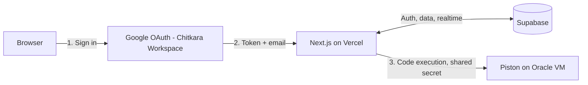

# Tech Track — Technical Requirements Document (TRD)

| | |
|---|---|
| **Companion to** | Tech Track PRD v1.0 |
| **Version** | 1.0 |
| **Status** | Ready for Phase 1 |

This document defines *how* Tech Track gets built. It assumes everything in the PRD and turns it into an implementation blueprint: architecture, schema, APIs, security, and deployment.

---

## 1. Tech Stack

| Layer | Choice | Notes |
|---|---|---|
| Frontend | Next.js 14 (App Router), React, TypeScript | One codebase for UI + backend logic |
| Styling | Tailwind CSS | Fast to build, consistent by default |
| Backend | Next.js Route Handlers / Server Actions | No separate backend service to deploy |
| Auth | Supabase Auth, Google provider | Ties directly into Postgres row-level security |
| Database | Supabase Postgres | |
| Realtime | Supabase Realtime | Live leaderboard, live invite status |
| Code execution | Self-hosted Piston (Docker) | C, C++, Python |
| Hosting — app | Vercel | Auto-deploy from GitHub |
| Hosting — judge | Oracle Cloud "Always Free" VM (Ampere A1, 2 OCPU/12GB) | Dedicated to Piston only |
| Reverse proxy — judge VM | Caddy or Nginx + shared-secret header | Stops the execution endpoint being publicly abusable |

## 2. System Architecture



The domain restriction happens twice: once as a UX hint (Google's `hd` parameter pre-filters the login screen to `chitkara.edu.in`), and once as a hard server-side check on the returned email after login. The `hd` hint alone is not a security control — only the server-side check is.

## 3. Data Model

One design decision worth calling out: **solo and team participation are modeled as the same thing** — a "unit." A solo entry is just a unit with one member. This means the entire event engine, scoring, codes, and leaderboard only ever need to reason about "units," not branch constantly between solo and team logic.

```sql
-- Extends Supabase's built-in auth.users with app-specific profile data
create table public.users (
  id uuid primary key references auth.users(id) on delete cascade,
  email text unique not null,
  name text not null,
  mobile_number text,
  roll_no text,
  branch text,
  semester int,
  role text not null default 'participant'
    check (role in ('participant','checkpoint_staff','admin','super_admin')),
  profile_completed boolean not null default false,
  created_at timestamptz not null default now()
);

-- A "unit" is a solo entry or a team, modeled identically
create table public.units (
  id uuid primary key default gen_random_uuid(),
  unit_type text not null check (unit_type in ('solo','team')),
  name text,                    -- team name; auto-labeled for solo
  leader_id uuid not null references public.users(id),
  locked boolean not null default false,
  locked_at timestamptz,
  disqualified boolean not null default false,
  disqualified_reason text,
  disqualified_at timestamptz,
  created_at timestamptz not null default now()
);

create table public.unit_members (
  id uuid primary key default gen_random_uuid(),
  unit_id uuid not null references public.units(id) on delete cascade,
  user_id uuid not null references public.users(id),
  status text not null default 'pending'
    check (status in ('pending','accepted','declined')),
  invited_at timestamptz not null default now(),
  responded_at timestamptz,
  unique (unit_id, user_id)
);

create table public.checkpoints (
  id uuid primary key default gen_random_uuid(),
  location_name text not null,
  round_number int not null unique
);

create table public.riddles (
  id uuid primary key default gen_random_uuid(),
  checkpoint_id uuid not null references public.checkpoints(id),
  round_number int not null unique,
  content text not null
);

-- Auto-generated per unit per checkpoint -- never shared, never typed by admin
create table public.unit_checkpoint_codes (
  id uuid primary key default gen_random_uuid(),
  unit_id uuid not null references public.units(id) on delete cascade,
  checkpoint_id uuid not null references public.checkpoints(id),
  secret_code text not null,
  unique (unit_id, checkpoint_id)
);

create table public.coding_questions (
  id uuid primary key default gen_random_uuid(),
  round_number int not null unique,
  prompt text not null,
  sample_input text,
  sample_output text
);

create table public.test_cases (
  id uuid primary key default gen_random_uuid(),
  question_id uuid not null references public.coding_questions(id) on delete cascade,
  input text not null,
  expected_output text not null,
  is_visible boolean not null default false
);

create table public.submissions (
  id uuid primary key default gen_random_uuid(),
  unit_id uuid not null references public.units(id),
  question_id uuid not null references public.coding_questions(id),
  code text not null,
  language text not null check (language in ('c','cpp','python')),
  passed boolean not null default false,
  attempt_number int not null,
  submitted_at timestamptz not null default now()
);

create table public.round_progress (
  id uuid primary key default gen_random_uuid(),
  unit_id uuid not null references public.units(id),
  round_number int not null,
  status text not null default 'pending'
    check (status in ('pending','skipped','passed')),
  points int not null default 0,
  completed_at timestamptz,
  unique (unit_id, round_number)
);

create table public.proctoring_events (
  id uuid primary key default gen_random_uuid(),
  unit_id uuid not null references public.units(id),
  question_id uuid references public.coding_questions(id),
  event_type text not null,
  occurred_at timestamptz not null default now()
);

create table public.announcements (
  id uuid primary key default gen_random_uuid(),
  message text not null,
  created_by uuid not null references public.users(id),
  created_at timestamptz not null default now()
);

create table public.notifications (
  id uuid primary key default gen_random_uuid(),
  unit_id uuid not null references public.units(id),
  message text not null,
  created_by uuid not null references public.users(id),
  created_at timestamptz not null default now(),
  read boolean not null default false
);

create table public.audit_log (
  id uuid primary key default gen_random_uuid(),
  actor_id uuid not null references public.users(id),
  action_type text not null,
  action_detail jsonb,
  created_at timestamptz not null default now()
);

create table public.event_settings (
  id int primary key default 1,
  registration_open boolean not null default true,
  event_live boolean not null default false,
  total_rounds int not null default 10,
  check (id = 1)
);
```

*(Starting schema — expect small adjustments once we're building against it.)*

## 4. API Design

| Area | Endpoint | Purpose |
|---|---|---|
| Profile | `POST /api/profile/complete` | Save mobile, roll no., branch, semester |
| Units | `POST /api/units/solo` | Create and lock a solo unit |
| Units | `POST /api/units/team` | Create a team unit as leader |
| Units | `POST /api/units/invite` | Invite a member by email |
| Units | `POST /api/units/respond` | Accept / decline an invite |
| Event | `POST /api/event/validate-code` | Check a submitted secret code |
| Event | `POST /api/event/submit` | Run code via Piston, check test cases |
| Event | `POST /api/event/skip` | Skip the current round |
| Proctoring | `POST /api/proctoring/log` | Log a tab-switch / blur event |
| Admin | CRUD `/api/admin/riddles` | Manage riddles |
| Admin | CRUD `/api/admin/questions` | Manage questions + test cases |
| Admin | CRUD `/api/admin/checkpoints` | Manage checkpoints |
| Admin | `POST /api/admin/registration/close` | Close registration; finalize units; generate codes |
| Admin | `POST /api/admin/event/toggle` | Start / stop the live event |
| Admin | `POST /api/admin/disqualify` | Disqualify a unit |
| Admin | `POST /api/admin/override-points` | Manually adjust a round's points |
| Admin | `POST /api/admin/notify` | Send a targeted notification |
| Admin | `POST /api/admin/announce` | Post a global announcement |
| Admin | `GET /api/admin/audit-log` | View the audit log |
| Admin | `GET /api/admin/codes/export` | Printable backup code sheet |
| Staff | `GET /api/staff/checkpoint-code` | Look up a specific unit's code at their checkpoint |
| Super Admin | `POST /api/admin/promote` | Grant / revoke Admin role |

## 5. Code Execution (Piston) Integration

- Piston's public API isn't usable for this (restricted since Feb 2026) — we call our own self-hosted instance directly.
- Explicit resource limits, set per request rather than relying on Piston's defaults: `run_timeout` ~5s, `compile_timeout` ~10s, `memory_limit` ~128–256MB.
- Test cases are checked **server-side only** — hidden test cases and expected outputs never reach the browser, or a participant could just read them from devtools.
- All hidden test cases must pass for the round to award a point; any fail lets the participant retry or skip. Every attempt is logged as its own `submissions` row (supports unlimited retries and gives a full attempt history).
- Codes in `unit_checkpoint_codes` are generated automatically for every (unit × checkpoint) pair the moment registration closes — not typed in by hand. At 10–15 units × ~10 checkpoints that's 100–150 codes; Admin can export a printable sheet as a backup for checkpoint staff.

## 6. Security

- **Row-Level Security (Supabase):**
  - `users` — a user reads/updates only their own row; admin/super_admin read all.
  - `units`, `unit_members`, `submissions`, `round_progress` — visible to that unit's own members; admin/super_admin read all.
  - `unit_checkpoint_codes` — admin/super_admin see everything; checkpoint_staff see only their assigned checkpoint(s).
  - `notifications` — visible only to the target unit's members.
  - `announcements` — readable by all authenticated users.
  - `audit_log` and admin content tables — admin/super_admin only.
- **Judge isolation:** no outgoing network from submitted code, per-submission CPU/memory/time caps, separate unprivileged user per run (Piston + Isolate).
- **Judge exposure:** the Oracle VM's Piston port is not public — reachable only via the reverse proxy with a shared-secret header known only to the Vercel backend.
- **Rate limiting** on the submit/validate-code endpoints to prevent scripted abuse.
- **Secrets:** service-role keys and the Piston shared secret live server-side only, never in the client bundle.

## 7. Environment Variables

| Variable | Purpose |
|---|---|
| `NEXT_PUBLIC_SUPABASE_URL` | Supabase project URL |
| `NEXT_PUBLIC_SUPABASE_ANON_KEY` | Client-side Supabase key |
| `SUPABASE_SERVICE_ROLE_KEY` | Server-only, elevated access |
| `PISTON_API_URL` | Internal URL of the self-hosted judge |
| `PISTON_SHARED_SECRET` | Auth header between Vercel and the judge VM |
| `GOOGLE_HD_DOMAIN` | `chitkara.edu.in`, passed as the OAuth `hd` hint |

## 8. Deployment

- **App:** Vercel, connected to the GitHub repo, auto-deploys `main`, preview deployments per pull request.
- **Judge VM:** Docker Compose running Piston behind the reverse proxy; restart policy set to survive VM reboots.
- **Keep-alive:** a scheduled job (Vercel Cron or a GitHub Action) pings both Supabase and the Piston health endpoint every few days, addressing the auto-pause / idle-reclaim risks noted in the PRD.

## 9. Testing Strategy

- Unit tests for scoring and code-validation logic.
- One end-to-end integration test covering registration → lock → event → final score, against a seeded test unit.
- Load test in Week 8: simulate 15–20 concurrent submissions against the Piston VM to validate the capacity estimate in the PRD before event day.

## 10. Monitoring

- Vercel's built-in function logs for errors — sufficient at this scale, no need for a paid error-tracking add-on.
- A free uptime checker (e.g., UptimeRobot) pinging the app and the judge VM's health endpoint.

## 11. Project Structure

```
/app
  /(auth)/login
  /(dashboard)/page.tsx
  /(dashboard)/event/page.tsx
  /(admin)/...
  /api/...            # route handlers matching Section 4
/lib
  /supabase           # client + server helpers
  /piston             # judge client wrapper
  /validation
/components
/types
```
